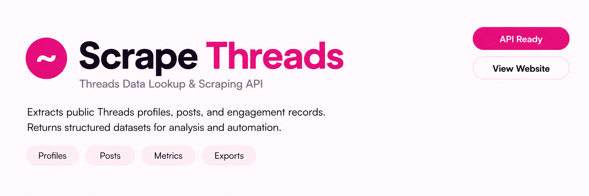
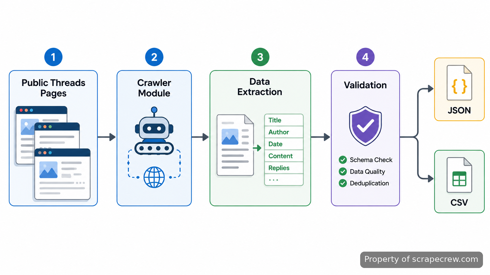
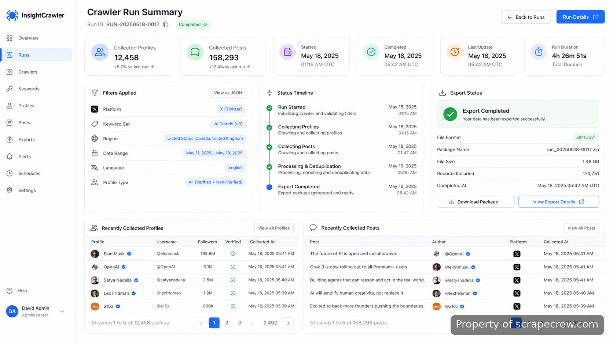
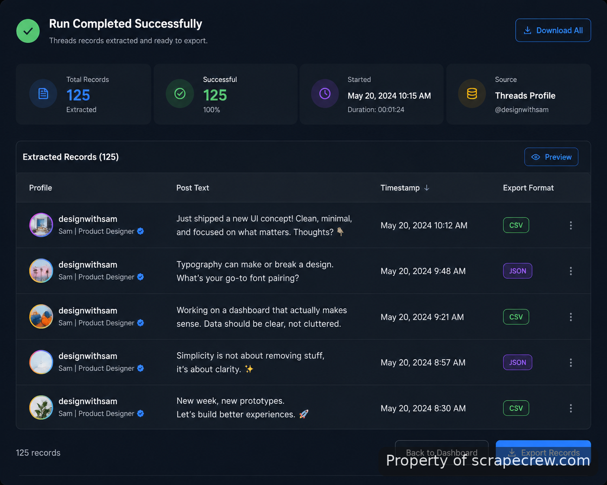
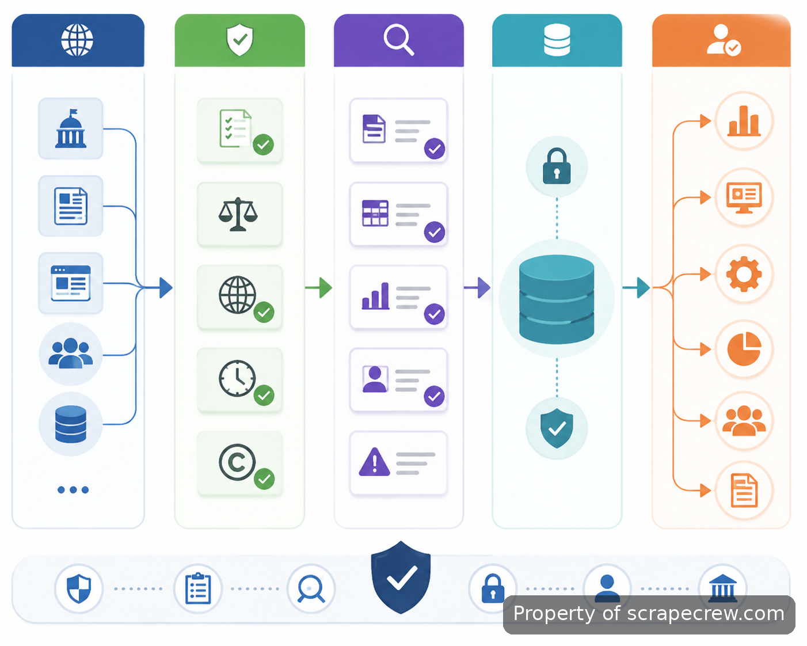

<p align="center">
  <a href="https://www.scrapecrew.com/scraper/threads-scraper-post-export" target="_blank">
    
  </a>
</p>

<p align="center">
  <a href="https://t.me/Bitbash333" target="_blank">
    
  </a>&nbsp;
  <a href="https://wa.me/923249868488?text=Hi%2C%20I%27m%20interested%20in%20ScrapeCrew." target="_blank">
    
  </a>&nbsp;
  <a href="mailto:hello@scrapecrew.com" target="_blank">
    
  </a>&nbsp;
  <a href="https://www.scrapecrew.com" target="_blank">
    
  </a>
</p>

## CogWorkLabs' Threads Crawler

CogWorkLabs' Threads Crawler is built for collecting public Threads content into structured datasets without manually copying posts, profiles, or engagement details. The system handles discovery, extraction, validation, and export steps so researchers and automation teams can work from organized records instead of scattered browser sessions.

> A focused collection pipeline for public Threads content and structured datasets.



## Public data collection workflow

Collecting social content manually creates inconsistent records and makes repeated research difficult. The crawler follows defined collection rules, captures available public fields, and stores results in formats that can be passed into analysis tools or internal systems.

The extraction layer is designed around responsible access patterns. When API-based access is available, the workflow can reference the official [Threads API documentation](https://developers.facebook.com/docs/threads) and related platform requirements. For browser-based collection flows, the system processes accessible public pages and normalizes returned information.

## Core Features

| Feature | Description |
| --- | --- |
| Public Profile Collection | Finding profile information manually takes repeated searches. The crawler captures available public profile fields and keeps records grouped by source. |
| Post Extraction Pipeline | Research teams often need posts gathered consistently. The system collects visible post data and prepares it for downstream processing. |
| Structured Data Formatting | Unformatted scraping output creates cleanup work. The exporter maps collected fields into predictable JSON and CSV structures. |
| Filtering Controls | Large collections can contain irrelevant records. Configurable filters help narrow extraction runs by defined inputs and collection rules. |
| Run Logging | Repeated extraction jobs are difficult to audit without history. The tool records run details, timestamps, and processing results. |



## Social media data extraction use cases

- Research teams can collect public discussions into structured files for trend analysis instead of maintaining manual spreadsheets.
- Marketing analysts can gather public profile and post records to review audience conversations and content patterns.
- Developers can feed exported datasets into internal dashboards, reporting systems, or additional processing scripts.
- Automation teams can connect collected records with existing workflows through JSON export and scheduled extraction runs.

## Technical architecture and data handling

The implementation separates collection, parsing, storage, and export responsibilities. This keeps changes to one layer from affecting the entire workflow. Python-based processing can support request handling, parsing logic, and data transformation, while storage layers keep extraction history available for review.

The workflow follows common scraping engineering practices such as request control, field validation, duplicate checks, and structured output generation. Browser automation components can be connected through tools such as [Playwright documentation](https://playwright.dev/docs/intro), while data processing routines can follow [Python documentation](https://docs.python.org/3/).

```text
threads-crawler/
├── src/
│   ├── crawler.py
│   ├── parser.py
│   ├── exporter.py
│   └── validators.py
├── config/
│   └── settings.json
├── data/
│   └── exports/
├── requirements.txt
└── README.md
```

## Web scraping automation setup

The project is delivered as a working extraction system. Teams can review configuration values, connect their workflow requirements, and run collection jobs from the prepared environment.

```bash
pip install -r requirements.txt
python src/crawler.py --config config/settings.json
```

## How to Run Public Collection Using CogWorkLabs' Threads Crawler

- **STEP 1 — Download & Set Up the Project** Download [**CogWorkLabs' Threads Crawler**](https://www.scrapecrew.com/scraper/threads-scraper-post-export) to access the prepared project package and connect the required collection settings.
- **STEP 2 — Open the Configuration** Load the project settings file and review target pages, collection options, and output preferences before starting a run.
- **STEP 3 — Select Extraction Inputs** Enter supported profile or post targets, apply filters, and define the fields required for the exported dataset.
- **STEP 4 — Run and Export Results** Start the collection process and receive validated records in configured JSON or CSV output files.



## JSON export and downstream workflows

Teams often need extracted records in a format that other systems can consume. JSON export keeps field names consistent, allowing the collected data to move into analytics tools, databases, or custom applications.

For teams that need changes beyond the packaged workflow, CogWorkLabs also provides [web scraping automation](https://www.scrapecrew.com/scraper/threads-scraper-post-export) support for custom extraction logic, deployment adjustments, monitoring, and additional features.

## Performance and reliability considerations

Extraction workloads vary based on source availability, requested fields, and collection scope. The project includes validation and logging layers so failed records can be identified instead of silently entering the dataset. Monitoring practices can follow guidance from resources such as the [OWASP Logging Cheat Sheet](https://cheatsheetseries.owasp.org/cheatsheets/Logging_Cheat_Sheet.html).

## Responsible collection practices

Public data collection requires attention to platform rules, access restrictions, and applicable regulations. Teams should review the [Meta Platform Terms](https://developers.facebook.com/terms) and relevant privacy requirements before deploying collection workflows at scale.



## FAQ

### How does the crawler collect public Threads data?

The crawler collects available public content through configured extraction workflows and organizes returned information into structured records. The process includes validation steps to keep collected fields consistent before export.

### Can the crawler export collected records as JSON files?

Yes. The export layer prepares collected records as JSON files with consistent field structures. These files can then be used by analytics systems, databases, or custom applications.

### Does the crawler use the official Threads API?

The workflow can reference official API access where available and follows documented platform requirements. Collection methods depend on the permitted access path and the data required for the project.

<table>
  <tr>
    <td align="center" width="33%">
      
      <p>This scraper helped me gather thousands of posts effortlessly. The setup was fast, and exports are super clean and well-structured.</p>
      <p><b>Nathan Pennington</b><br>Marketer<br>★★★★★</p>
    </td>
    <td align="center" width="33%">
      
      <p>What impressed me most was how accurate the extracted data is. Likes, comments, timestamps — everything aligns perfectly.</p>
      <p><b>Greg Jeffries</b><br>SEO Affiliate Expert<br>★★★★★</p>
    </td>
    <td align="center" width="33%">
      
      <p>It's by far the best tool I've used. Ideal for trend tracking, competitor monitoring, and influencer insights.</p>
      <p><b>Karan</b><br>Digital Strategist<br>★★★★★</p>
    </td>
  </tr>
</table>